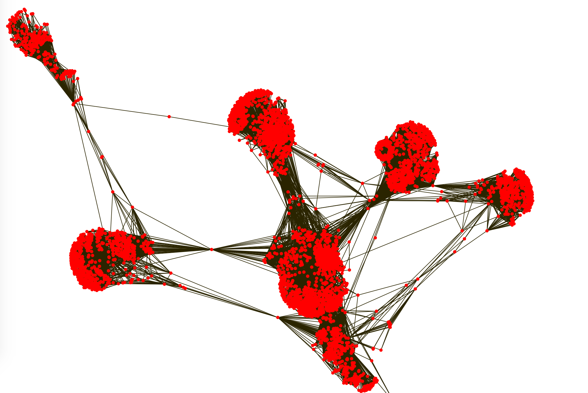

# ogdf.js

### Introduction

The project is actively developing. My idea is to compile the ogdf library into javascript using [emscripten](https://github.com/emscripten-core/emscripten). Now the library is compiled to ogdf.js(WASM based) successfully. More details will be updated later.

You can see the layout performance in [the random square graph](./squareLayout.html) and [facebook network](./facebookLayout.html)(use python -m http.server). They use the FM3 graph layout algorithm from the ogdf library and get a faster performance compared to some algorithms such as D3 force in the browser.



### How to use

now I have writen two layout: [FM3](https://www.semanticscholar.org/paper/Drawing-Large-Graphs-with-a-Potential-Field-Based-Hachul-J%C3%BCnger/3a389251f7e3879622eff52da5493cdc56a0ace4), [Pviot MDS](http://mrvar.fdv.uni-lj.si/pajek/community/DrawPivotMDS.htm)

```js
initOGDF().then(function (Module) {
    	...
    	// we assume the nodes, links store the data similar to usage in d3.force
    	let nodes = graph.nodes.length
        let links = graph.links.length
        let source = Module._malloc(4 * links);
        let target = Module._malloc(4 * links);

    	// store the edge information to wasm array
        for (let i = 0; i < links; ++i) {
            Module.HEAP32[source / 4 + i] = dic[graph.links[i].source];
            Module.HEAP32[target / 4 + i] = dic[graph.links[i].target];
        }
        let result = Module._FM3(nodes, links, source, target);
    	// or: let result = Module._PMDS(nodes, links, source, target);

    	// get nodes position from result
    	for (let i = 0; i < nodes; ++i) {
            graph.nodes[i]['x'] = Module.HEAPF32[(result >> 2) + i * 2]
            graph.nodes[i]['y'] = Module.HEAPF32[(result >> 2) + i * 2 + 1];
        }
    	...

    	Module._free(source);
        Module._free(target);
        Module._free_buf(result);

});
```

### How to build it?

We suggest you to build ogdf.js with Linux or MacOS. Before building the ogdf.js, you should make sure you have enviroments to build C++ library:

-   Git
-   CMake
-   Compiling tools. GCC (Linux), Xcode (MacOS), or Visual Studio 2015+ (Windows)
-   Python 2.7.x

#### Building Steps

1. Download and install [Emscripten](https://github.com/emscripten-core/emscripten). Here is several main steps, and please refer to [the official document](https://emscripten.org/docs/getting_started/downloads.html) for more details:

    ```bash
    # Get the emsdk repo
    $ git clone https://github.com/emscripten-core/emsdk.git

    # Enter that directory
    $ cd emsdk

    # Fetch the latest version of the emsdk (not needed the first time you clone)
    $ git pull

    # Download and install the latest SDK tools.
    $ ./emsdk install latest

    # Make the "latest" SDK "active" for the current user. (writes .emscripten file)
    $ ./emsdk activate latest

    # Activate PATH and other environment variables in the current terminal
    $ source ./emsdk_env.sh
    ```

    On Windows, you should replace `./emsdk` with `emsdk` and replace `source ./emsdk_env.sh` with `emsdk_env`. To ensure that you have install Emscripten successfully, you can create a folder with a file:

    ```bash
    $ mkdir hello
    $ cd hello
    $ echo '#include <stdio.h>' > hello.c
    $ echo 'int main(int argc, char ** argv) {' >> hello.c
    $ echo 'printf("Hello, world!\n");' >> hello.c
    $ echo '}' >> hello.c
    $ emcc hello.c -s WASM=1 -o hello.html
    ```

2. Build ogdf library.

    ```bash
    $ cd ogdf
    $ mkdir build && cd build
    $ emcmake cmake ..
    $ emmake make
    ```

3. Build ogdf.js
    ```bash
    $ make ogdf.js
    ```

### Progress

-   add PMDS algorithm
-   use initOGDF to start which can use mutiple times in browser(better than Module onRuntime)
